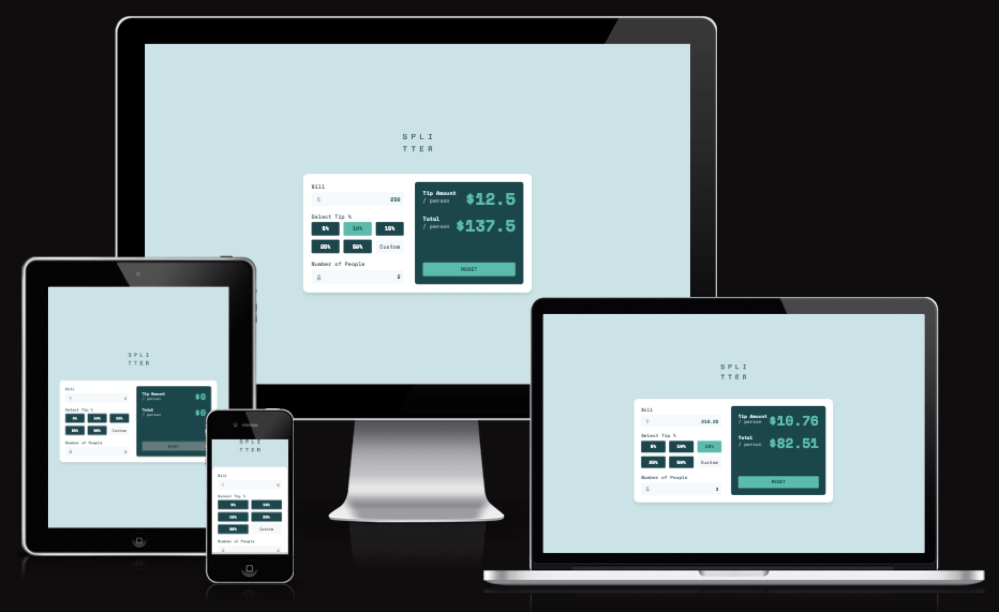

# Frontend Mentor - Tip Calculator App

This is a solution to the [Tip calculator app challenge on Frontend Mentor](https://www.frontendmentor.io/challenges/tip-calculator-app-ugJNGbJUX).

-   [Overview](#overview)
    -   [The challenge](#the-challenge)
    -   [Screenshot](#screenshot)
    -   [Links](#links)
-   [My process](#my-process)
    -   [Built with](#built-with)
    -   [Learning Outcomes](#learning-outcomes)
    -   [Continued development](#continued-development)
    -   [Useful resources](#useful-resources)

## Overview

### The challenge

Users should be able to:

-   View the optimal layout for the app depending on their device's screen size
-   See hover states for all interactive elements on the page
-   Display useful prompts and error messages
-   Totals should dynamically update
-   Calculate the correct tip and total cost of the bill per person

### Screenshot

## My process

### Built with

-   [Sass](https://sass-lang.com/) - CSS Preprocessor
-   [petite-vue](https://github.com/vuejs/petite-vue) - Javascript Library
-   [Reactive](https://vuejs.org/guide/essentials/reactivity-fundamentals.html) - Vue module
-   [http-server](https://github.com/http-party/http-server) - Static HTTP Server

### Learning Outcomes

The purpose of building this app from [Frontend Mentor](https://www.frontendmentor.io/challenges) was to learn/practice using [petite-vue](https://github.com/vuejs/petite-vue) for an upcoming project at work.

[petite-vue](https://github.com/vuejs/petite-vue) along with the `reactive()` module were great choices to use for this app to dynamically handle the users input and generate the correct output. All in all thoroughly enjoyed my first taste of Vue and I can't wait to get further stuck into it.

### Continued development

Taking this challenge one step further I would like to implement dynamic currency depending on the users location or preference. I would handle this by using something like the `navigator.geoloaction` API to get the users location (if allowed), then use [Intl.NumberFormat.prototype.formatToParts()](https://developer.mozilla.org/en-US/docs/Web/JavaScript/Reference/Global_Objects/Intl/NumberFormat/formatToParts) to set the correct currency.

### Useful resources

Below are the two useful, short YouTube tutorials that I used to get started with using [petite-vue](https://github.com/vuejs/petite-vue).

-   [petite-vue tutorial - Program With Erik](https://www.youtube.com/watch?v=v5gA3Nx41Aw)
-   [petite-vue tutorial - Shawn Wildermuth](https://www.youtube.com/watch?v=YL9gkm-Ihpk)
